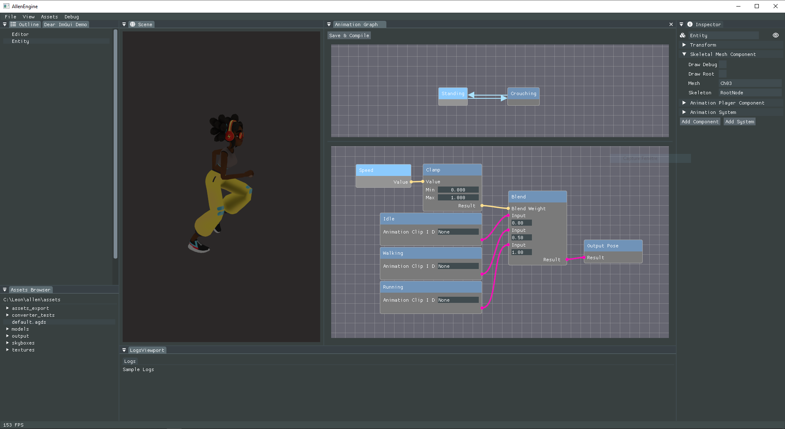

# Allen Engine

Allen is a pet 3D game engine I started developing on my free time while in lockdown. 

It's mostly a playground I use to learn, experiment and practice on a bunch of subjects:
 - general c++, the std, and better coding practice
 - computer graphics
 - overcomplicated build systems (using CMake)
 - software architecture
 - game engine building pieces

It sports all sorts of modules, some of which are in a good shape, some others that should only be approached with a flamethrower:
 - a rendering engine with skinning and animation, using vulkan
 - an entity/component system based on [this talk from Bobby Anguelov](https://www.youtube.com/watch?v=jjEsB611kxs)
 - a runtime type reflection system
 - an asynchronous asset loading system
 - an animation system based on [this other talk also from Bobby](https://www.youtube.com/watch?v=Jkv0pbp0ckQ)
 - a rough editor UI

I had planned to clean things up before making the repo public *but* I found myself in a position where I need to show off what I know before I've  had the time to do it. Please excuse the mess !

## Dependencies
 - vulkan SDK
 - [assimp](https://github.com/assimp/assimp)
 - [fmt](https://github.com/fmtlib/fmt) (while waiting for `std::format`)
 - [glfw](https://github.com/glfw/glfw)
 - [glm](https://github.com/g-truc/glm)
 - [gsl](https://github.com/microsoft/GSL) (for `std::span`)
 - [imgui](https://github.com/ocornut/imgui)
 - [json](https://github.com/nlohmann/json)
 - [lz4](https://github.com/lz4/lz4)
 - [stduuid](https://github.com/mariusbancila/stduuid)
 - [tracy](https://github.com/wolfpld/tracy)
 - [enkiTS](https://github.com/dougbinks/enkiTS)